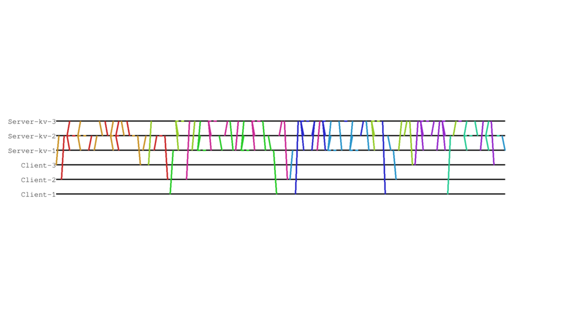

# Lumberjack

Log visualizer for whirl-framework

## Установка

```
pip install -r requirements.txt
```

## Как пользоваться

```
python3 -l <путь до лога> -o <путь до отчета>
```

### Пример

```
python3 -l examples/log.txt -o out.png
```

Результат работы скрипта:

